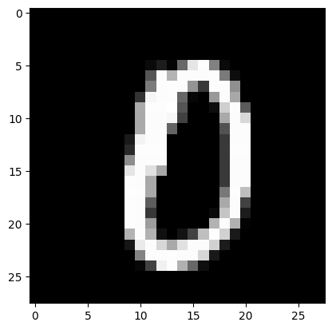
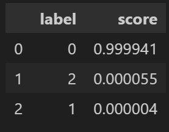
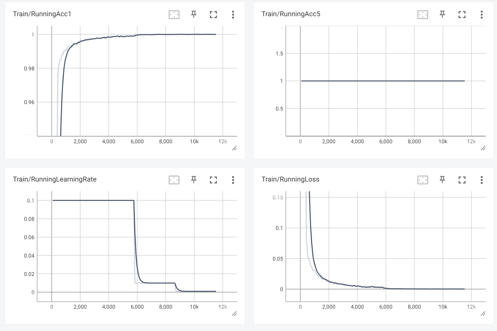
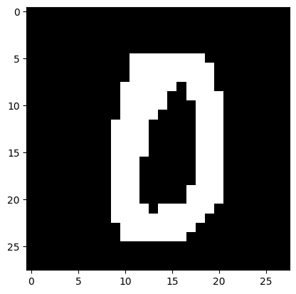
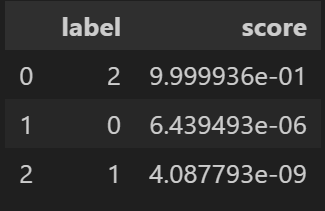

# 实现自制MNIST数据集的三分类
1. 下载[MNIST](http://yann.lecun.com/exdb/mnist/)数据集，形式为gz压缩包，需要使用python脚本对其进行解压操作，获得train和test两个文件夹。每个文件夹中包含0-9共10个子文件夹，文件夹中有png格式，整数编号的图像。接着选取训练集和测试集中0-2三个类别作为自制数据集。 

2. 实现基于pytorch的对自制数据集的分类。分类的基础框架为[torch_classificaion](https://github.com/hysts/pytorch_image_classification)。该框架提供了多个主流分类器模型，通过yaml文件实现模型构建和参数管理。但原文的模型训练调用了torch.vision.dataset类，在训练MNIST和CIFAR数据时直接通过url链接下载并读取到GPU当中，作者没有提供相应的自制数据集训练的接口和tutorial。因此首先需要在该框架上实现自制数据集训练和验证。  
# 2.1 yaml文件修改  
以paramidet结构为例，在yaml文件中可以直接大部分针对MNIST数据集的参数设置。需要更改的主要代码部分如下。
```yaml
device: cuda
dataset:
name: Self_Dataset
model:
type: mnist
name: pyramidnet
init_mode: kaiming_fan_out
pyramidnet:
depth: 272
initial_channels: 16
block_type: bottleneck
alpha: 200
```
其中主要更改的部分为dataset部分，同时也对相应的Self_Dataset.yaml文件进行更改。对应部分如下所示。主要修改的部分为name，将其与模型yaml的dataset.name对应；其次是dataset_dir,改为自制数据集的路径；另外根据数据格式更改image_size和n_channels输入通道；由于是三分类任务，因此将labels改为只包含前三个标签的列表。
```yaml
dataset:
  name: Self_Dataset
  dataset_dir: './data/'
  image_size: 28
  n_channels: 1
  n_classes: 3
  labels: ['0','1','2']
augmentation:
  use_random_crop: True
  use_random_horizontal_flip: False
  use_cutout: False
  use_random_erasing: False
  use_dual_cutout: False
  use_mixup: False
  use_ricap: False
  use_cutmix: False
  use_label_smoothing: False
``` 
# 2.2 datasets.py更改  
datasets.py用来创建继承torch.utils.data中Dataset类的自制数据类。需要实现的功能有__getitem__和__len__，即根据给定下标返回数据集中的对应数据和标签和返回数据集中的数据总数。对于自制数据集，实现思路为首先在数据集路径下创建csv文件用来储存每张图片的标签（即子文件夹名称）和对应的路径，在__getitem__函数中直接读取csv文件中的标签和路径来获得图像标签对；__len__函数则通过csv文件长度本身获取。生成csv文件的对应代码如下。
```python
import os 
import csv

dataset_mom_path = './data/MNIST/' #convert MNIST to the file's name of your own Dataset

train_path = dataset_mom_path + 'train/'
test_path = dataset_mom_path + 'test/'
train_class = os.listdir(dataset_mom_path + 'train/')

data = []
data_test = []

with open(dataset_mom_path + 'train_mnist_custom.csv','w',newline='',encoding='utf-8') as csvfile: #change the .csv file name too
    writer = csv.DictWriter(csvfile,fieldnames = ['class','path'])
    writer.writeheader()
    for cls in train_class:
        cls_pth = train_path + cls + '/'
        file_ls = os.listdir(cls_pth)
        for img in file_ls:
            file_path = cls_pth + img
            #writer.writerows({'class':int(cls),'path':file_path}) #writing in a single row of dic is now allowed!
            data.append({'class':int(cls),'path':file_path})
            print("writing:",cls,' ',file_path)
    writer.writerows(data)
    
with open(dataset_mom_path + 'test_mnist_custom.csv','w',newline='',encoding='utf-8') as csvfile: #change the .csv file name too
    writer = csv.DictWriter(csvfile,fieldnames = ['class','path'])
    writer.writeheader()
    for cls in train_class:
        cls_pth = test_path + cls + '/'
        file_ls = os.listdir(cls_pth)
        for img in file_ls:
            file_path = cls_pth + img
            #writer.writerows({'class':int(cls),'path':file_path}) #writing in a single row of dic is now allowed!
            data_test.append({'class':int(cls),'path':file_path})
            print("writing:",cls,' ',file_path)
    writer.writerows(data_test)
```  
实现的自制数据集Dataset类如下：
```python
csv_dir = './data/MNIST/train_mnist_custom.csv' #Change the dir to your own csv file 
csv_dir_test = './data/MNIST/test_mnist_custom.csv'

def get_label_from_csv(csv_dir = csv_dir):
    df = pd.read_csv(csv_dir)
    label_all = df.iloc[:,0].unique()
    return label_all

class CustomDataset(Dataset):
    def __init__(self,config: yacs.config.CfgNode,is_train: bool,transform = None) -> None:
        if is_train:
            self.csv_path = csv_dir
            self.labels = get_label_from_csv(csv_dir)
            df = pd.read_csv(self.csv_path)
            self.dict_list = df.to_dict(orient='records')
            self.transform = create_transform(config,is_train=True)
        else:
            self.csv_path = csv_dir_test
            self.labels = get_label_from_csv(csv_dir_test)
            df = pd.read_csv(self.csv_path)
            self.dict_list = df.to_dict(orient='records')
            self.transform = create_transform(config,is_train=False)
    
    def __len__(self):
        return len(self.dict_list)
        
    def __getitem__(self, index):
        dic_index = self.dict_list[index]
        label,path = dic_index.values()
        img = cv2.imread(path)
        img_tensor = torch.from_numpy(img)
        img_tensor = img_tensor.permute(2, 0, 1)
        img_tensor = self.transform(img_tensor)
        img_tensor = img_tensor.permute(1,2,0)
        return (img_tensor,label)
```
其中的is_train用来根据yaml信息决定输入到模型中的图像是否需要经过tranform预处理变换。
# 2.3 train.py文件修改 
完成自制Dataset类后，需要在train.py文件中获取相应的model类并修改相关参数。创建自制数据集模型model类和载入自制数据集的关键是读取正确的yaml文件并创建对应的config，实现代码如下所示。  
```python
def load_config():
    parser = argparse.ArgumentParser()
    parser.add_argument('--config', type=str,default = './configs/self_dataset/resnet.yaml' )
    parser.add_argument('--resume', type=str, default='')
    parser.add_argument('--local_rank', type=int, default=0)
    parser.add_argument('options', default=None, nargs=argparse.REMAINDER)
    args = parser.parse_args()

    config = get_default_config()
    if args.config is not None:
        config.merge_from_file(args.config)
    config.merge_from_list(args.options)
    if not torch.cuda.is_available():
        config.device = 'cpu'
        config.train.dataloader.pin_memory = False
    if args.resume != '':
        config_path = pathlib.Path(args.resume) / 'config.yaml'
        config.merge_from_file(config_path.as_posix())
        config.merge_from_list(['train.resume', True])
    config.merge_from_list(['train.dist.local_rank', args.local_rank])
    config = update_config(config)
    config.freeze()
    return config

def main():
    config = load_config()
    set_seed(config)
    setup_cudnn(config)
    epoch_seeds = np.random.randint(np.iinfo(np.int32).max // 2,
                                    size=config.scheduler.epochs)
    if config.train.distributed:
        dist.init_process_group(backend=config.train.dist.backend,
                                init_method=config.train.dist.init_method,
                                rank=config.train.dist.node_rank,
                                world_size=config.train.dist.world_size)
        torch.cuda.set_device(config.train.dist.local_rank)

    output_dir = pathlib.Path(config.train.output_dir)
    if get_rank() == 0:
        if not config.train.resume and output_dir.exists():
            raise RuntimeError(
                f'Output directory `{output_dir.as_posix()}` already exists')
        output_dir.mkdir(exist_ok=True, parents=True)
        if not config.train.resume:
            save_config(config, output_dir / 'config.yaml')
            save_config(get_env_info(config), output_dir / 'env.yaml')
            diff = find_config_diff(config)
            if diff is not None:
                save_config(diff, output_dir / 'config_min.yaml')

    logger = create_logger(name=__name__,
                           distributed_rank=get_rank(),
                           output_dir=output_dir,
                           filename='log.txt')
    logger.info(config)
    logger.info(get_env_info(config))

    train_loader, val_loader = create_dataloader(config, is_train=True)

    model = create_model(config)
```
通过修改load_config()中的config读取路径即可并结合**2.2**即可实现对自制数据集的训练过程，同时以.pth文件的形式保存训练后的模型参数。另外在计算模型性能时的指标acc1和acc5也要根据数据集类别总数进行相应修改。在本实验中acc5实际为acc3，恒为1。对应代码部分如下。
```python
   acc1, acc5 = compute_accuracy(config,
                                      outputs,
                                      targets,
                                      augmentation=True,
                                      topk=(1, 3))   # change the top k according to the class num of custom dataset
```

3. 通过训练完成的.pth文件进行特定图像的预测并输出相应的软标签。通过torch中的model类load_state_dict()函数即可创建加载了训练后权重的模型，模型创建过程与**2.3**相同。输入图像后输出softmax产生的软标签结果，即可获得模型对于输入图像对于每个标签的可能性，便于后续更多攻击方法的实践。实现代码和结果如下。  
```python
data = transform(PIL.Image.fromarray(img))
with torch.no_grad():
    pred = model(data.unsqueeze(0).to(device))
prob = F.softmax(pred, dim=1).cpu()

scores, indices = prob.topk(k=3)
scores = scores.numpy().ravel()

indices = indices.numpy().ravel()
pd.DataFrame({'label': indices, 'score': scores})
```  
<table>
    <tr>
        <td ><center>输入测试图 </center></td>
        <td ><center>图2 软标签结果图</center></td>
        <td ><center>图3 模型训练效果图</center></td>
    </tr>
</table> 
至此，自制数据集的三分类训练和检测结束且模型已实现收敛！   

***

# 基于自制模型实现对抗样本生成和测试
在对抗样本的生成过程中，选用[torchattacks](https://github.com/Harry24k/adversarial-attacks-pytorch)库直接攻击torch的model类，即可直接实现多种经典方法的对抗样本生成复现。本次实验中选用CW攻击方法，对应源码和输入格式要求如下。在攻击时依据示例设置相应的超参数即可。由于选取1张图像进行攻击，攻击前需要拓展图像和标签的维度，使之满足batch=1的形式。
```python
import torch
import torch.nn as nn
import torch.optim as optim

from ..attack import Attack


class CW(Attack):
    r"""
    CW in the paper 'Towards Evaluating the Robustness of Neural Networks'
    [https://arxiv.org/abs/1608.04644]

    Distance Measure : L2

    Arguments:
        model (nn.Module): model to attack.
        c (float): c in the paper. parameter for box-constraint. (Default: 1)    
            :math:`minimize \Vert\frac{1}{2}(tanh(w)+1)-x\Vert^2_2+c\cdot f(\frac{1}{2}(tanh(w)+1))`
        kappa (float): kappa (also written as 'confidence') in the paper. (Default: 0)
            :math:`f(x')=max(max\{Z(x')_i:i\neq t\} -Z(x')_t, - \kappa)`
        steps (int): number of steps. (Default: 50)
        lr (float): learning rate of the Adam optimizer. (Default: 0.01)

    .. warning:: With default c, you can't easily get adversarial images. Set higher c like 1.

    Shape:
        - images: :math:`(N, C, H, W)` where `N = number of batches`, `C = number of channels`,        `H = height` and `W = width`. It must have a range [0, 1].
        - labels: :math:`(N)` where each value :math:`y_i` is :math:`0 \leq y_i \leq` `number of labels`.
        - output: :math:`(N, C, H, W)`.

    Examples::
        >>> attack = torchattacks.CW(model, c=1, kappa=0, steps=50, lr=0.01)
        >>> adv_images = attack(images, labels)

    .. note:: Binary search for c is NOT IMPLEMENTED methods in the paper due to time consuming.

    """

    def __init__(self, model, c=1, kappa=0, steps=50, lr=0.01):
        super().__init__("CW", model)
        self.c = c
        self.kappa = kappa
        self.steps = steps
        self.lr = lr
        self.supported_mode = ["default", "targeted"]

    def forward(self, images, labels):
        r"""
        Overridden.
        """

        images = images.clone().detach().to(self.device)
        labels = labels.clone().detach().to(self.device)

        if self.targeted:
            target_labels = self.get_target_label(images, labels)

        # w = torch.zeros_like(images).detach() # Requires 2x times
        w = self.inverse_tanh_space(images).detach()
        w.requires_grad = True

        best_adv_images = images.clone().detach()
        best_L2 = 1e10 * torch.ones((len(images))).to(self.device)
        prev_cost = 1e10
        dim = len(images.shape)

        MSELoss = nn.MSELoss(reduction="none")
        Flatten = nn.Flatten()

        optimizer = optim.Adam([w], lr=self.lr)

        for step in range(self.steps):
            # Get adversarial images
            adv_images = self.tanh_space(w)

            # Calculate loss
            current_L2 = MSELoss(Flatten(adv_images), Flatten(images)).sum(dim=1)
            L2_loss = current_L2.sum()

            outputs = self.get_logits(adv_images)
            if self.targeted:
                f_loss = self.f(outputs, target_labels).sum()
            else:
                f_loss = self.f(outputs, labels).sum()

            cost = L2_loss + self.c * f_loss

            optimizer.zero_grad()
            cost.backward()
            optimizer.step()

            # Update adversarial images
            pre = torch.argmax(outputs.detach(), 1)
            if self.targeted:
                # We want to let pre == target_labels in a targeted attack
                condition = (pre == target_labels).float()
            else:
                # If the attack is not targeted we simply make these two values unequal
                condition = (pre != labels).float()

            # Filter out images that get either correct predictions or non-decreasing loss,
            # i.e., only images that are both misclassified and loss-decreasing are left
            mask = condition * (best_L2 > current_L2.detach())
            best_L2 = mask * current_L2.detach() + (1 - mask) * best_L2

            mask = mask.view([-1] + [1] * (dim - 1))
            best_adv_images = mask * adv_images.detach() + (1 - mask) * best_adv_images

            # Early stop when loss does not converge.
            # max(.,1) To prevent MODULO BY ZERO error in the next step.
            if step % max(self.steps // 10, 1) == 0:
                if cost.item() > prev_cost:
                    return best_adv_images
                prev_cost = cost.item()

        return best_adv_images

    def tanh_space(self, x):
        return 1 / 2 * (torch.tanh(x) + 1)

    def inverse_tanh_space(self, x):
        # torch.atanh is only for torch >= 1.7.0
        # atanh is defined in the range -1 to 1
        return self.atanh(torch.clamp(x * 2 - 1, min=-1, max=1))

    def atanh(self, x):
        return 0.5 * torch.log((1 + x) / (1 - x))

    # f-function in the paper
    def f(self, outputs, labels):
        one_hot_labels = torch.eye(outputs.shape[1]).to(self.device)[labels]

        # find the max logit other than the target class
        other = torch.max((1 - one_hot_labels) * outputs, dim=1)[0]
        # get the target class's logit
        real = torch.max(one_hot_labels * outputs, dim=1)[0]

        if self.targeted:
            return torch.clamp((other - real), min=-self.kappa)
        else:
            return torch.clamp((real - other), min=-self.kappa)

``` 
相应的攻击过程代码如下所示。
```python
img_batch = np.expand_dims(image,axis=0)
img_batch = torch.from_numpy(np.transpose(img_batch,(0,3,1,2))).float()
labels = np.array([0])  # 示例标签数据
labels = torch.tensor(labels).long()
atk1 = torchattacks.CW(model=model,c=1,kappa=0,steps=50,lr=0.01)
adv_image_batch_cpu = (atk1(img_batch,labels=labels)).cpu()
adv_img = (adv_image_batch_cpu.numpy())[0]
``` 
对抗样本结果和对应预测结果如下图所示。  
<table>
    <tr>
        <td ><center>对抗样本图 </center></td>
        <td ><center>图2 对抗样本预测图</center></td>
    </tr>
</table> 
结果显示，由CW方法产生的对抗样本成功使分类模型将0误分类为2，且扰动较小，实验效果较为理想。